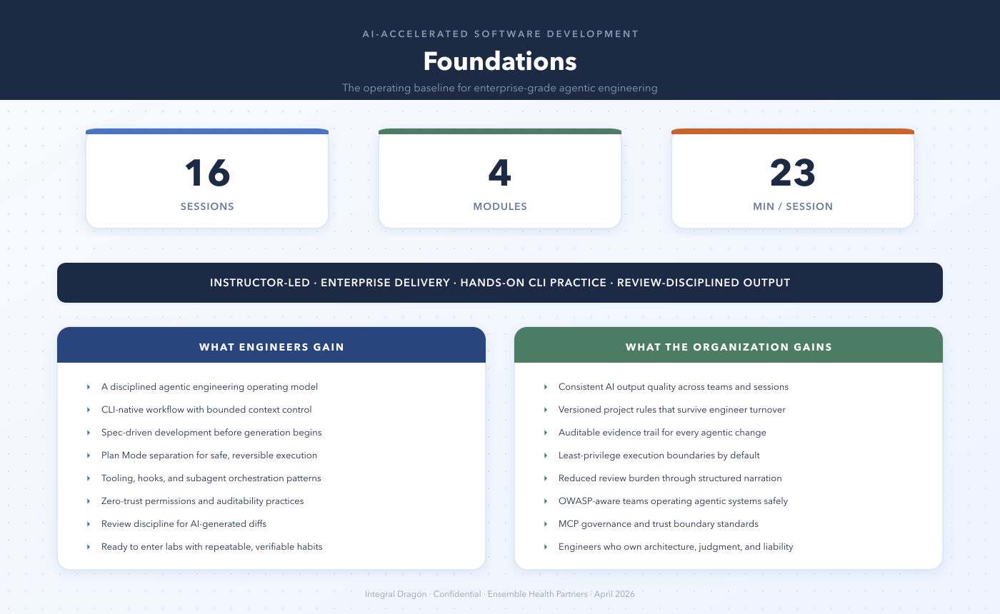
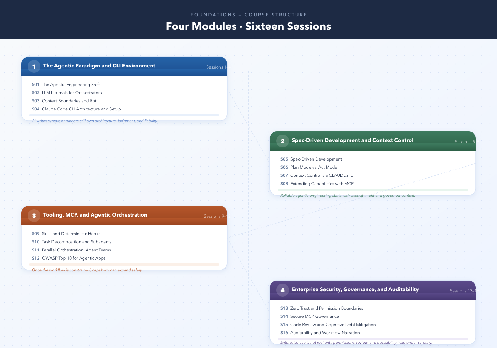
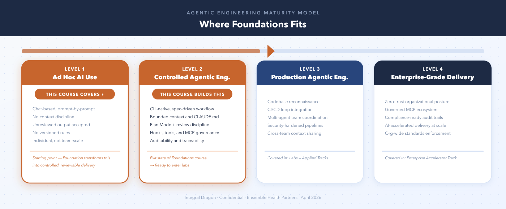

# AI-Accelerated Software Development — Foundations

**Integral Dragon** · Delivered for Ensemble Health Partners · April 2026

---

## Welcome

This repository contains all course materials for **AI-Accelerated Software Development: Foundations** — the first phase of Integral Dragon's agentic engineering curriculum delivered to Ensemble Health Partners.

Foundations is not a theory block. It is the operating baseline for trustworthy, enterprise-grade AI-accelerated delivery. Engineers leave this course with the posture, habits, and tooling discipline to enter hands-on labs.

---

## Why This Program

| Problem | What Foundations Addresses |
|---|---|
| Engineers use AI as a chat trick with no discipline | Establishes a structured agentic engineering operating model |
| AI output accepted without review or traceability | Instills review discipline and auditable narration |
| Project context lost between sessions and teammates | Versioned rules in CLAUDE.md survive sessions and engineer turnover |
| No standard for bounded, safe agent execution | Plan Mode separation, least-privilege permissions, and hook enforcement |
| Security posture undefined for agentic systems | OWASP awareness and zero-trust execution boundaries |

---

## Course Structure

16 sessions across 4 modules — approximately 23 minutes per session.

| Module | Sessions | Title | Core Message |
|---|---|---|---|
| 1 | S01–S04 | The Agentic Paradigm and CLI Environment | AI writes syntax; engineers own architecture, judgment, and liability |
| 2 | S05–S08 | Spec-Driven Development and Context Control | Reliable agentic engineering starts with explicit intent and governed context |
| 3 | S09–S12 | Tooling, MCP, and Agentic Orchestration | Once the workflow is constrained, capability can expand safely |
| 4 | S13–S16 | Enterprise Security, Governance, and Auditability | Enterprise use is not real until permissions, review, and traceability hold |

---

## What Engineers Will Be Able to Do

- Explain the difference between vibe coding and agentic engineering
- Choose the smallest useful context for a task
- Drive work from specs and reviewed plans
- Operate Claude Code inside explicit boundaries
- Decompose work across tools and agents safely
- Review and narrate AI-assisted changes in enterprise terms

---

## Where Foundations Fits

Foundations covers Levels 1 and 2 of the agentic engineering maturity model — transforming ad hoc AI usage into controlled, reviewable, enterprise-ready delivery. The exit state is readiness to enter applied lab tracks.

---

## Enterprise-Safe Delivery

| Requirement | Approach |
|---|---|
| No unapproved external data access | All exercises run against local or sandboxed repositories |
| Audit trail for AI-generated changes | Workflow narration and commit discipline taught explicitly |
| Controlled tool permissions | Plan Mode, permission boundaries, and MCP governance covered in course |
| Reproducible standards across teams | CLAUDE.md versioning and project rule authoring are core skills |
| Compliance-aware posture | OWASP Top 10 for agentic apps covered in Module 3 |

---

## Primary Tooling

- **Claude Code CLI** — primary agentic execution harness
- **CLAUDE.md** — persistent project rule encoding
- **MCP (Model Context Protocol)** — governed capability extension
- **Plan Mode** — safe separation of planning from mutation
- **Hooks** — deterministic enforcement at execution boundaries

---

## Core Workflow

Every session follows a consistent pattern:

1. Define intent via spec before generation begins
2. Enter Plan Mode — review and approve before acting
3. Execute with bounded context and enforced rules
4. Narrate and review AI-generated changes explicitly
5. Commit with traceable evidence of what changed and why

---

## Session Materials

### Module 1 — The Agentic Paradigm and CLI Environment

- [Session 01: The Agentic Engineering Shift](1-Foundations/Module-1-Agentic-Paradigm-and-CLI-Environment/Session-1-The-Agentic-Engineering-Shift/Artifacts/)
- [Session 02: LLM Internals for Orchestrators](1-Foundations/Module-1-Agentic-Paradigm-and-CLI-Environment/Session-2-LLM-Internals-for-Orchestrators/Artifacts/)
- [Session 03: Context Boundaries and Rot](1-Foundations/Module-1-Agentic-Paradigm-and-CLI-Environment/Session-3-Context-Boundaries-and-Rot/Artifacts/)
- [Session 04: Claude Code CLI Architecture and Setup](1-Foundations/Module-1-Agentic-Paradigm-and-CLI-Environment/Session-4-Claude-Code-CLI-Architecture-and-Setup/Artifacts/)

### Module 2 — Spec-Driven Development and Context Control

- [Session 05: Spec-Driven Development](1-Foundations/Module-2-Spec-Driven-Development-and-Context-Control/Session-5-Spec-Driven-Development/Artifacts/)
- [Session 06: Plan Mode vs. Act Mode](1-Foundations/Module-2-Spec-Driven-Development-and-Context-Control/Session-6-Plan-Mode-vs-Act-Mode/Artifacts/)
- [Session 07: Context Control via CLAUDE.md](1-Foundations/Module-2-Spec-Driven-Development-and-Context-Control/Session-7-Context-Control-via-CLAUDE-md/Artifacts/)
- [Session 08: Extending Capabilities with MCP](1-Foundations/Module-2-Spec-Driven-Development-and-Context-Control/Session-8-Extending-Capabilities-with-MCP/Artifacts/)

### Module 3 — Tooling, MCP, and Agentic Orchestration

- [Session 09: Skills and Deterministic Hooks](1-Foundations/Module-3-Tooling-MCP-and-Agentic-Orchestration/Session-9-Skills-and-Deterministic-Hooks/Artifacts/)
- [Session 10: Task Decomposition and Subagents](1-Foundations/Module-3-Tooling-MCP-and-Agentic-Orchestration/Session-10-Task-Decomposition-and-Subagents/Artifacts/)
- [Session 11: Parallel Orchestration: Agent Teams](1-Foundations/Module-3-Tooling-MCP-and-Agentic-Orchestration/Session-11-Parallel-Orchestration-Agent-Teams/Artifacts/)
- [Session 12: OWASP Top 10 for Agentic Apps](1-Foundations/Module-3-Tooling-MCP-and-Agentic-Orchestration/Session-12-OWASP-Top-10-for-Agentic-Apps/Artifacts/)

### Module 4 — Enterprise Security, Governance, and Auditability

- [Session 13: Zero Trust and Permission Boundaries](1-Foundations/Module-4-Enterprise-Security-Governance-and-Auditability/Session-13-Zero-Trust-and-Permission-Boundaries/Artifacts/)
- [Session 14: Secure MCP Governance](1-Foundations/Module-4-Enterprise-Security-Governance-and-Auditability/Session-14-Secure-MCP-Governance/Artifacts/)
- [Session 15: Code Review and Cognitive Debt Mitigation](1-Foundations/Module-4-Enterprise-Security-Governance-and-Auditability/Session-15-Code-Review-and-Cognitive-Debt-Mitigation/Artifacts/)
- [Session 16: Auditability and Workflow Narration](1-Foundations/Module-4-Enterprise-Security-Governance-and-Auditability/Session-16-Auditability-and-Workflow-Narration/Artifacts/)

### Overview and Supplemental

- [Foundations Overview Slides](1-Foundations/overview/)
- [Supplemental: Coding Harness Example](1-Foundations/Supplemental-Coding-Harness-Example/)

---

*Integral Dragon · Confidential · Ensemble Health Partners · April 2026*
